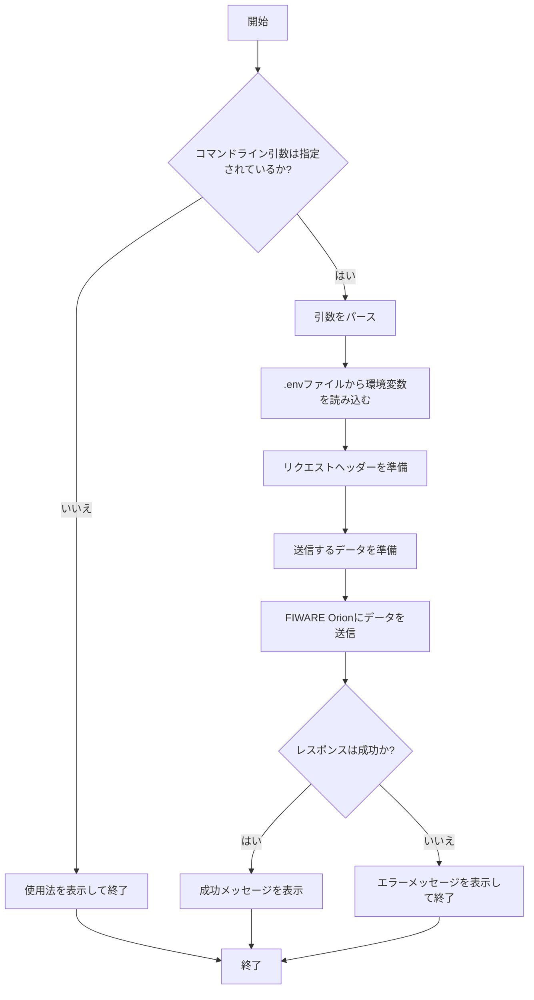
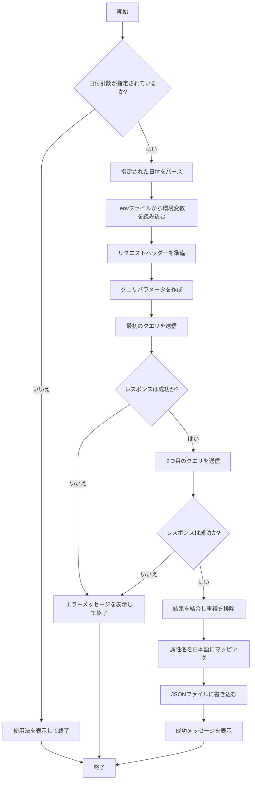

# 1. これはなに？
「浜松で地域課題解決やらまいか！ データ・フュージョン・キャンプ2024」にて作成した、浜松市のイベントデータのオープンデータのCSVファイルをダウンロードし、FIWARE Orion と送受信するサンプルコードです。

# ２．概要
FIWARE Orion Context Brokerを使用してイベントデータを送受信するプログラムです。

- **送信プログラム**: イベントデータをFIWARE Orionに送信します。
- **受信プログラム**: 指定した日付のイベントデータをFIWARE Orionから取得し、日本語の項目名でJSONファイルに出力します。

## 目次

- [必要な環境とライブラリ](#必要な環境とライブラリ)
- [環境変数の設定](#環境変数の設定)
- [送信プログラムの使い方](#送信プログラムの使い方)
- [受信プログラムの使い方](#受信プログラムの使い方)
- [プログラムのフロー図](#プログラムのフロー図)
  - [送信プログラムのフロー図](#送信プログラムのフロー図)
  - [受信プログラムのフロー図](#受信プログラムのフロー図)

## 必要な環境とライブラリ

- Python 3.x
- 以下のコマンドで必要なPythonライブラリをインストールします:

  ```bash
  pip install -r requirements.txt
  ```

## 環境変数の設定
`.env`ファイルを作成し、以下の情報を設定してください。
```
FIWARE_AUTHORIZATION=yourauthorizationkey
FIWARE_ORION_ENDPOINT=http://yourendpoint/
FIWARE_SERVICE=hamamatsu_event
FIWARE_SERVICE_PATH=/events
CSV_URL=https://example.com/yourdata.csv
```

- `FIWARE_AUTHORIZATION`: 認証トークン（必要な場合のみ）
- `FIWARE_ORION_ENDPOINT`: FIWARE OrionのエンドポイントURL
- `FIWARE_SERVICE`: FIWAREのサービス名
- `FIWARE_SERVICE_PATH`: FIWAREのサービスパス
- `CSV_URL`: CSVファイルのURL

## 送信プログラムの使い方
1. プログラムの実行
```bash
python push.py
```

2. プログラムの概要
`.env`で指定したURLからCSVファイルをダウンロードし、翌日のイベント分をFIWARE Orionに送信します。環境変数から取得した情報を使用して、リクエストヘッダーを設定します。

## 受信プログラムの使い方
1. プログラムの実行
```bash
python pull.py YYYY-MM-DD
```
YYYY-MM-DD: 取得したいイベントの日付

2. プログラムの概要
- 指定した日付のイベントをFIWARE Orionから取得し、日本語の項目名でJSONファイルに出力します。
- 出力ファイルは`events_YYYY-MM-DD.json`という形式になります

# プログラムのフロー図
## 送信プログラムのフロー図


## 受信プログラムのフロー図

# ３．ライセンス
このプロジェクトはMITライセンスの下で公開されています。

# ４．作者
TEAM AMEOTOKO